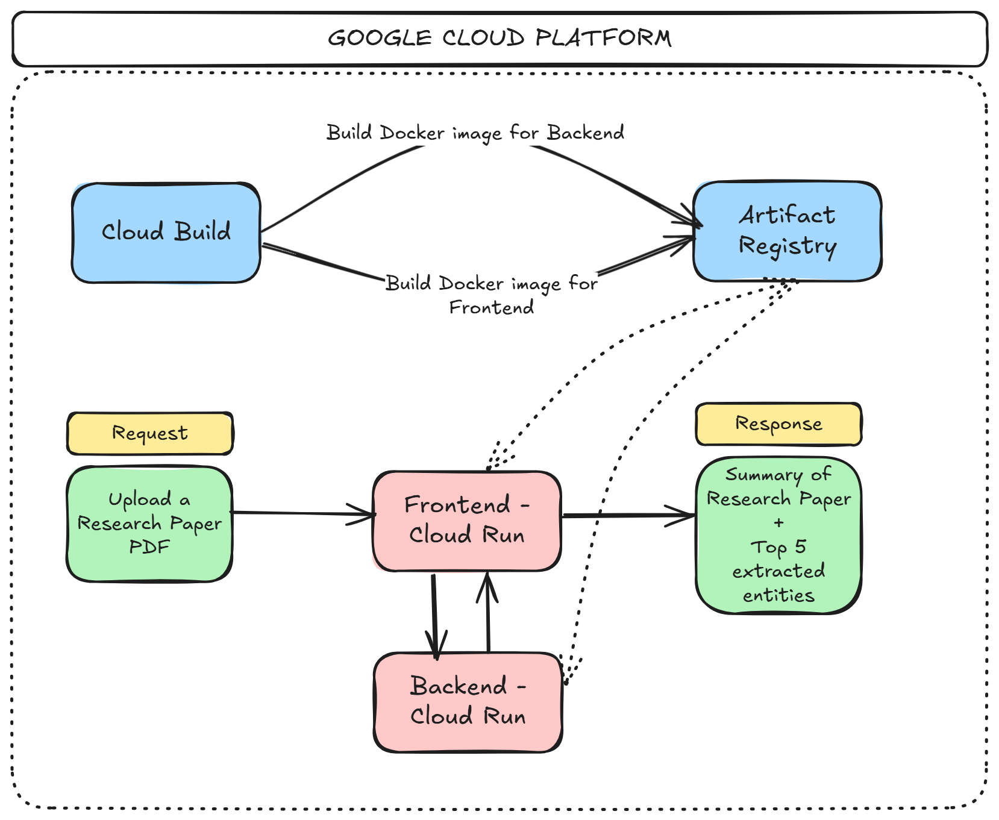

# AI-powered Research Paper Analyzer

Solution contained in this git repository showcases on how to build & deploy a Generative AI based application to extract a summary & key entities from any uploaded research paper.
This solution focuses on build & deployment on Google Cloud w/ a focus on scalability, extensibility & automation w/ use of services such as Cloud Run, Artifact Registry, Cloud Build using Terraform for Infrastructure as code (IaC)

High-level flow captured in the following illustration:

## Potential Queries/Review questions

1. **Technical Choices:**
- Use of managed services on Google Cloud allows for an automated & scalable approach
- Leveraging FastAPI for the backend service allows modularization w/ async operations & more customizable error handling
- Use of Gradio for the frontend service allows for quick prototyping of the solution

2. **Entity Contextualization:**
This solution leverages Gemini-Flash-2.0 for parsing through the entire PDF & extracting information. While this approach can be considered as a baseline, further improvements on the same can be extended w/ the current codebase setup

3. **Error Handling:**
Current solution included standard error handling provided by the FastAPI package around HTTP status codes & request validation

4. **Improvement Propositions:**
- Backend can be further expanded to parse PDFs using `unstructured`/`pypdf` libraries as well as applying an OCR layer (potentially DocumentAI on Google Cloud) to extract more complex image-based information from PDFs
- Deployed Cloud Run services can include further security & IAP-based authentication
- While Gradio is a great choice for quick UI prototyping, ReAct would be the more future-proof choice for building the frontend